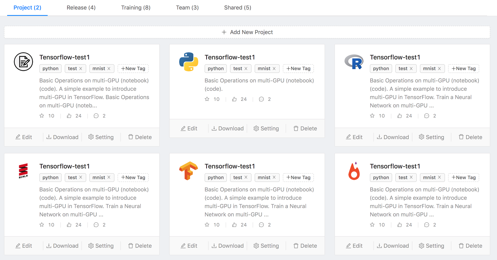
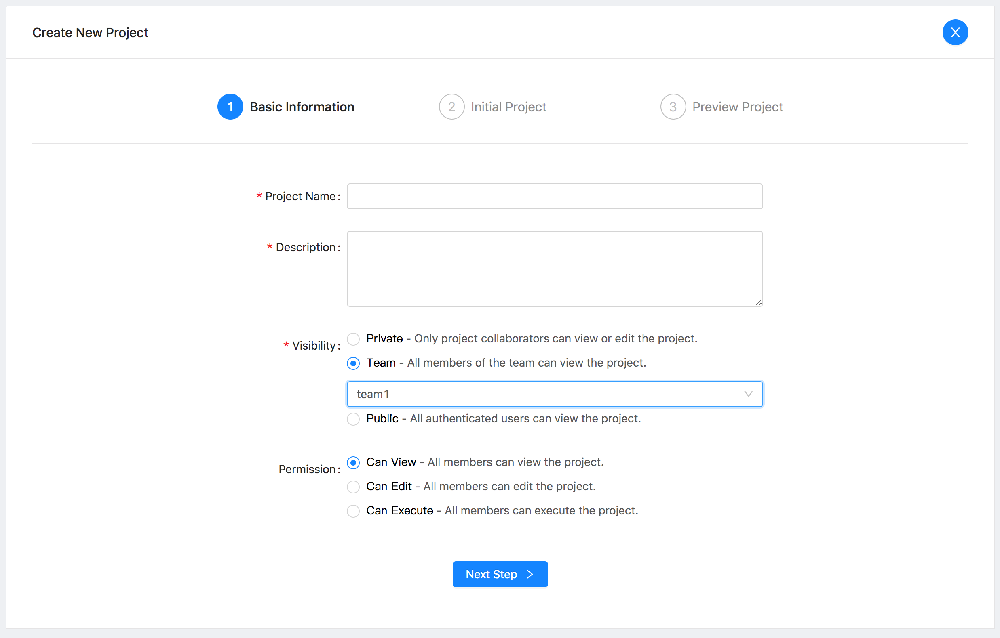
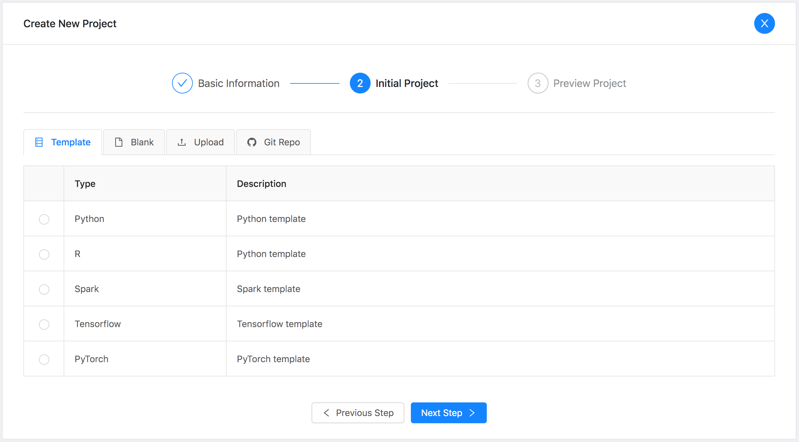
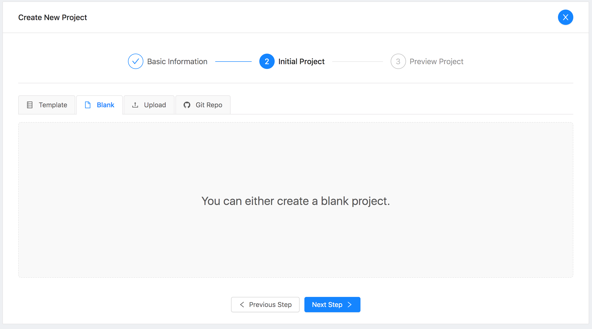
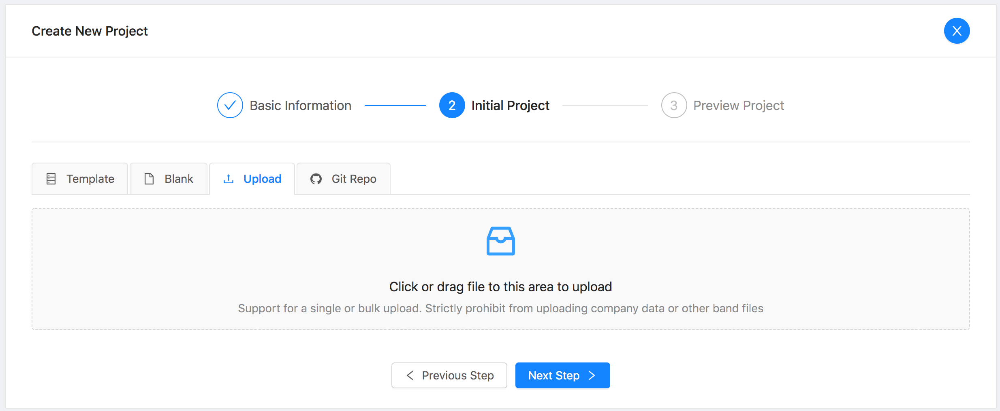
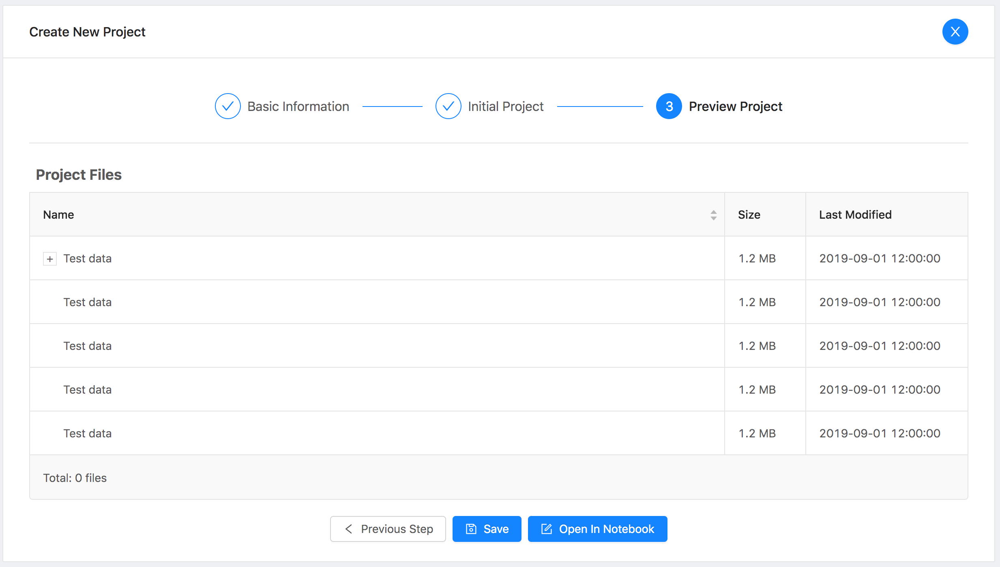

<!--
   Licensed to the Apache Software Foundation (ASF) under one or more
   contributor license agreements.  See the NOTICE file distributed with
   this work for additional information regarding copyright ownership.
   The ASF licenses this file to You under the Apache License, Version 2.0
   (the "License"); you may not use this file except in compliance with
   the License.  You may obtain a copy of the License at
   http://www.apache.org/licenses/LICENSE-2.0
   Unless required by applicable law or agreed to in writing, software
   distributed under the License is distributed on an "AS IS" BASIS,
   WITHOUT WARRANTIES OR CONDITIONS OF ANY KIND, either express or implied.
   See the License for the specific language governing permissions and
   limitations under the License.
-->

[English](./README.md) | 简体中文

# Submarine Workbench Introduction

`Submarine Workbench` 是为数据科学家设计的 WEB 系统。数据科学家可以通过 `Submarine Workbench` 进行交互式的访问 `Notebook`，提交/管理 Job，管理模型，创建模型训练工作流，访问数据集等。

## Register

每个需要使用 Submarine 进行机器学习算法开发的用户，都可以登录 `Submarine Workbench` 的 WEB 首页，在首页上，点击注册链接，填写用户名、注册邮箱和密码就可以完成注册，但此时用户状态为 `等待审核` 状态。

管理员在  `Submarine Workbench` 中接收到用户的注册请求后，设置用户的操作权限，所属机构部门和分配资源，设置用户状态为 `审核通过` 后，用户才可以登录 Submarine Workbench。

## Login

每个 Submarine 的用户在 `Login` 页面中输入用户名和密码，登录到  `Submarine Workbench` 的首页 `Home`。

## Home

在 `Submarine Workbench` 的 `Home` 首页中，顶层通过四个图表显示了用户的资源的使用情况和任务执行的情况。

在 `Quick Start` 列表中，显示了 Workbench 中最常使用的功能链接，方便用户可以快速的进行工作。

在 `Open Recent` 列表中，显示了用户最近使用过的九个项目，方便你快速的进行工作。

在 `What‘s New？` 列表中，显示了 Submarine 最新发布的一些功能特性和项目信息，方便你了解 Subamrine 项目的最新进展。

## Workspace

Workspace 主要有五个 Tab 页组成，每个 Tab 页的标题中显示了各自项目的总数。

### Project

在 Project 页面中，以卡片的方式显示了用户自己创建的所有 Project。

每个 Project 卡片由以下部分内容组成：

1. **Project 类型**：目前 Submarine 支持 `Notebook`、`Python`、`R`、`Scala`、`Tensorflow` 和 `PyTorch` 这六种类型的机器学习算法框架和开发语言，在项目卡片中以对应的图标进行标识。
2. **Project Tags**：用户可以为每个 Project 打上不同的 `Tag` 标签，方便查找和管理。
3. **Github/Gitlab 集成**：Submarine Workbench 与 `Github`/`Gitlab` 进行了系统集成，每个 Project 都可以在 Workbench 中进行 `Watch`、`Star`、`Frok` 和 `Comment` 操作。
   + **Watch**：[TODO]
   + **Star**：[TODO]
   + **Frok**：[TODO]
   + **Comment**：用户可以在项目中进行评论
4. **Edit**：用户通过双击项目或者点击 `Edit` 按钮，可以在 `Notebook` 中打开项目，进行算法开发等操作。
5. **Download**：用户通过点击 `Download` 按钮，将项目打包下载到本地。
6. **Setting**：编辑项目信息，例如项目的名字，简介，分享级别和权限。
7. **Delete**：删除项目中所有包含的文件。 

#### Add New Project

在项目页面中点击 `Add New Project` 按钮，将会显示出创建项目的引导页面，只需要三个步骤就可以创建一个新的项目。

第一步：在 **Base Information** 步骤中填写项目名称、项目简介。

+ **Visibility**: 设置项目对外的可见级别
  
  + **Private**: （默认）设置为私有项目，不对外公开项目中包含的所有文件，但是可以在 **Notebook** 中将项目的执行结果单独设置公开，方便其他人查看项目的可视化报告。
  + **Team**: 设置为团队项目，在团队选择框中选择团队的名称，团队的其他成员可以根据设置的权限访问这个项目。
  + **Public**: 设置为公开项目，**Workbench** 中的所有用户都可以通过搜索查看到这个项目。
+ **Permission**: 设置项目对外的访问权限，只有将项目的 **Visibility** 设置为 **Team** 或 **Public** 的时候，才会出现权限设置界面。
  
  + **Can View**
  
    当项目的 **Visibility** 设置为 **Team** 时，团队中其他成员都只能**查看**这个项目的文件。
  
    当项目的 Visibility 设置为 **Public** 时，**Workbench** 中其他成员都只能**查看**这个项目的文件。
  
  + **Can Edit**
  
    当项目的 **Visibility** 设置为 **Team** 时，团队中其他成员都可以**查看**、**编辑**这个项目的文件。
  
    当项目的 **Visibility** 设置为 **Public** 时，**Workbench** 中其他成员都可以**查看**、**编辑**这个项目的文件。
  
  + **Can Execute**
  
    当项目的 **Visibility** 设置为 **Team** 时，团队中其他成员都可以**查看**、**编辑**、**执行**这个项目的文件。
  
    当项目的 **Visibility** 设置为 **Public** 时，**Workbench** 中其他成员都可以**查看**、**编辑**、**执行**这个项目的文件。

第二步：在 **Initial Project** 步骤中，**Workbench** 提供了四种项目初始化的方式

+ **Template**: **Workbench** 内置了几种不同开发语言和算法框架的项目模版，你可以选择任何一种模版初始化你的项目，无需做任何修改就可以直接在 **Notebook** 中执行，特别适合新手进行快速的体验。

  

+ **Blank**：创建一个空白的项目，稍后，我们可以通过在 **Notebook** 中手工添加项目的文件

  

+ **Upload**: 通过上传 **notebook** 格式的文件来初始化你的项目，**notebook** 格式兼容 **Jupyter Notebook** 和 **Zeppelin Notebook** 文件格式。

  

+ **Git Repo**: 在你的 **Github**/**Gitlab** 账号中 **Frok** 一个仓库中的文件内容来初始化项目。

  

第三步：预览项目中的所包含的文件

+ **Save**: 将项目保存到 Workspace 中。
+ **Open In Notebook**: 将项目保存到 **Workspace** 中，并用 **Notebook** 打开项目。

### Release

[TODO]

### Training

[TODO]

### Team

[TODO]

### Shared

[TODO]

## Interpreters

[TODO]

## Job

[TODO]

## Data

[TODO]

## Model

[TODO]

## Manager

### User

[TODO]

### Team

[TODO]

### Data Dict

[TODO]

### Department

[TODO]

