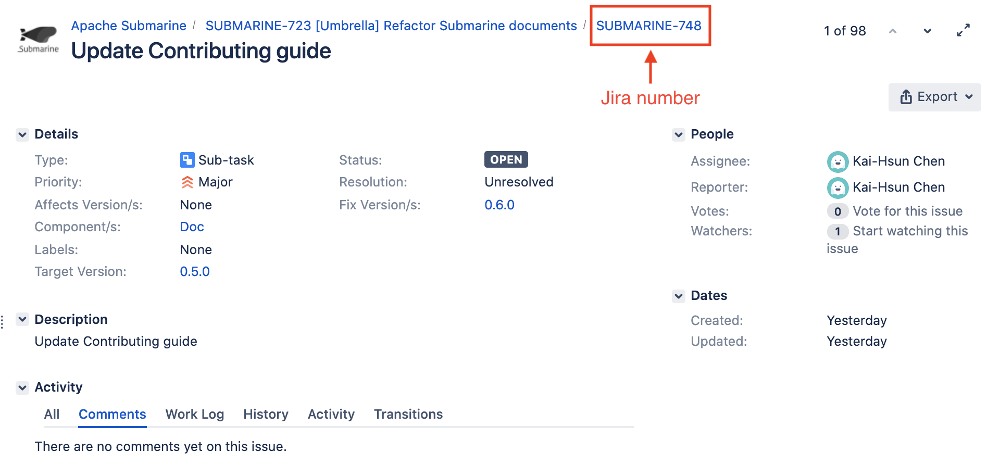
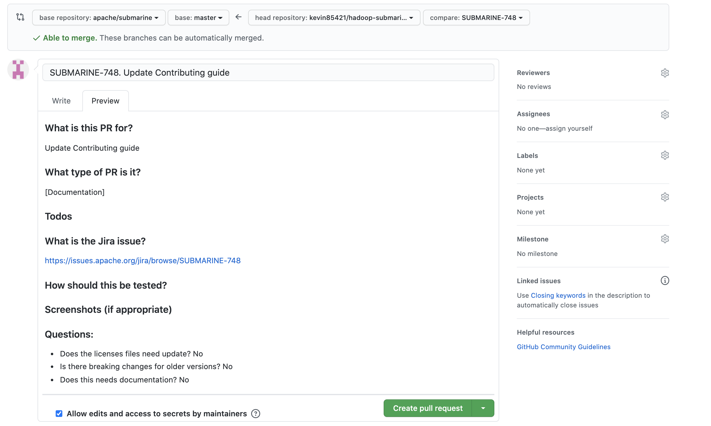

<!--
Licensed under the Apache License, Version 2.0 (the "License");
you may not use this file except in compliance with the License.
You may obtain a copy of the License at

http://www.apache.org/licenses/LICENSE-2.0

Unless required by applicable law or agreed to in writing, software
distributed under the License is distributed on an "AS IS" BASIS,
WITHOUT WARRANTIES OR CONDITIONS OF ANY KIND, either express or implied.
See the License for the specific language governing permissions and
limitations under the License.
-->

## Preface
* **Apache Submarine** is an [Apache 2.0 License](https://github.com/apache/submarine/blob/master/LICENSE) Software. Contributing to Submarine means you agree to the Apache 2.0 License. 
* Please read [Code of Conduct](http://www.apache.org/foundation/policies/conduct.html) carefully.
* The document [How It Works](http://www.apache.org/foundation/how-it-works.html) can help you understand Apache Software Foundation further.

## Build Submarine
* [Build From Code](https://github.com/apache/submarine/blob/master/website/docs/devDocs/BuildFromCode.md)

## Creating patches
Submarine follows [Fork & Pull](https://github.com/sevntu-checkstyle/sevntu.checkstyle/wiki/Development-workflow-with-Git:-Fork,-Branching,-Commits,-and-Pull-Request) model.

### Step1: Fork apache/submarine github repository (first time)
* Visit https://github.com/apache/submarine
* Click the `Fork` button to create a fork of the repository

### Step2: Clone the Submarine to your local machine 
```sh
# USERNAME – your Github user account name.
git clone git@github.com:${USERNAME}/submarine.git
# or: git clone https://github.com/${USERNAME}/submarine.git 
 
cd submarine
# set upstream 
git remote add upstream git@github.com:apache/submarine.git
# or: git remote add upstream https://github.com/apache/submarine.git

# Don't push to the upstream master.
git remote set-url --push upstream no_push

# Check upstream/origin:
# origin    git@github.com:${USERNAME}/submarine.git (fetch)
# origin    git@github.com:${USERNAME}/submarine.git (push)
# upstream  git@github.com:apache/submarine.git (fetch)
# upstream  no_push (push)
git remote -v
```

### Step3: Create a new Jira in Submarine project
* New contributors need privilege to create JIRA issues. Please email kaihsun@apache.org with your Jira username. In addition, the email title should be "[New Submarine Contributor]".
* Check [Jira issue tracker](https://issues.apache.org/jira/projects/SUBMARINE/issues/SUBMARINE-748?filter=allopenissues) for existing issues.
* Create a new Jira issue in Submarine project. When the issue is created, a Jira number (eg. SUBMARINE-748) will be assigned to the issue automatically. 



### Step4: Create a local branch for your contribution
```sh
cd submarine

# Make your local master up-to-date
git checkout master
git fetch upstream 
git rebase upstream/master

# Create a new branch fro issue SUBMARINE-${jira_number}
git checkout -b SUBMARINE-${jira_number}

# Example: git checkout -b SUBMARINE-748 
```

### Step5: Develop & Create commits
* You can edit the code on the `SUBMARINE-${jira_number}` branch. (Coding Style: [Code Convention](#code-convention))
* Create commits
```sh
git add ${edited files}
git commit -m "SUBMARINE-${jira_number}. ${Commit Message}"
# Example: git commit -m "SUBMARINE-748. Update Contributing guide" 
```

### Step6: Syncing your local branch with upstream/master 
```sh
# On SUBMARINE-${jira_number} branch
git fetch upstream
git rebase upstream/master
```

* Please do not use `git pull` to synchronize your local branch. Because `git pull` does a merge to create merged commits, these will make commit history messy.

### Step7: Push your local branch to your personal fork
```sh
git push origin SUBMARINE-${jira_number} 
```

### Step8: Check Travis-ci status of your personal fork
* Visit `https://travis-ci.org/github/${USERNAME}/submarine`
* Please make sure your new commits can pass all integration tests before creating a pull request.

### Step9: Create a pull request on github UI
* Visit your fork at `https://github.com/${USERNAME}/submarine.git`
* Click `Compare & Pull Request` button to create pull request.


#### Pull Request template
* [Pull request template](https://github.com/apache/submarine/blob/bd7578cc28f8280f9170938d4469fcc965e24a89/.github/PULL_REQUEST_TEMPLATE)
* Filling the template thoroughly can improve the speed of the review process. Example: 



### Step10: Check Travis-ci status of your pull request in apache/submarine
* Visit https://travis-ci.com/github/apache/submarine/pull_requests
* Please make sure your pull request can pass all integration tests. 

### Step11: The Review Process
* Anyone can be a reviewer and comment on the pull requests.
* Reviewer can indicate that a patch looks suitable for merging with a comment such as: "Looks good", "LGTM", "+1". (PS: LGTM = Looks Good To Me)
* At least one indication of suitability (e.g. "LGTM") from a committer is required to be merged. 
* A committer can then initiate lazy consensus ("Merge if there is no more discussion") after which the code can be merged after a particular time (usually 24 hours) if there are no more reviews.
* Contributors can ping reviewers (including committers) by commenting 'Ready to review'.

### Step12: Address review comments 
* Push new commits to SUBMARINE-${jira_number} branch. The pull request will update automatically.
* After you address all review comments, committers will merge the pull request.


### Code convention
We are following Google Code style:

* [Java style](https://google.github.io/styleguide/javaguide.html)
* [Shell style](https://google.github.io/styleguide/shell.xml)

There are some plugins to format, lint your code in IDE (use [dev-support/maven-config/checkstyle.xml](hhttps://github.com/apache/submarine/blob/master/dev-support/maven-config/checkstyle.xml) as rules)

* [Checkstyle plugin for Intellij](https://plugins.jetbrains.com/plugin/1065) ([Setting Guide](http://stackoverflow.com/questions/26955766/intellij-idea-checkstyle))
* [Checkstyle plugin for Eclipse](http://eclipse-cs.sourceforge.net/#!/) ([Setting Guide](http://eclipse-cs.sourceforge.net/#!/project-setup))