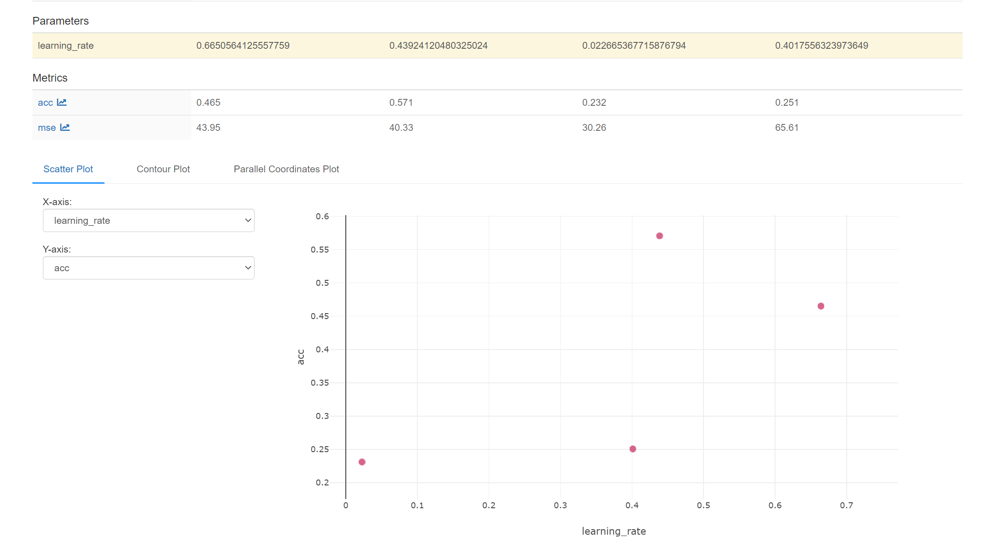

<!--
Licensed to the Apache Software Foundation (ASF) under one
or more contributor license agreements.  See the NOTICE file
distributed with this work for additional information
regarding copyright ownership.  The ASF licenses this file
to you under the Apache License, Version 2.0 (the
"License"); you may not use this file except in compliance
with the License.  You may obtain a copy of the License at

  http://www.apache.org/licenses/LICENSE-2.0

Unless required by applicable law or agreed to in writing,
software distributed under the License is distributed on an
"AS IS" BASIS, WITHOUT WARRANTIES OR CONDITIONS OF ANY
KIND, either express or implied.  See the License for the
specific language governing permissions and limitations
under the License.
-->

### Usage
MLflow UI shows the tracking result of the experiments. When we
use the log_param or log_metric in ModelClient API, we could view
the result in MLflow UI. Below is the example of the usage of MLflow
UI.

### Example
1. `cd ./submarine/dev-support/examples/tracking`
2. `eval $(minikube -p minikube docker-env)`
3. `sh build.sh`(it will take few minutes)
4. `sh post.sh`
5. In the MLflow UI page, you can see the log_param and the log_metric
    result. You can also compare the training between different workers.

